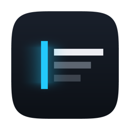

<p align="center">
  
</p>

<h1 align="center">Beam</h1>

<p align="center">
  A native macOS code editor with a budget for every millisecond.<br>
  <a href="https://nuterian.github.io/beam/">Website</a> ·
  <a href="https://github.com/nuterian/beam/releases/latest/download/Beam.dmg">Download for macOS</a> ·
  <a href="PLAN.md">The plan</a> ·
  <a href="perf/budgets.json">Budgets</a>
</p>

---

LAN-native collaboration on code, obsessed with input-to-photon latency. Native
macOS: Swift + AppKit shell, Metal glyph-atlas rendering, Network.framework +
Bonjour. No accounts, no cloud; code never leaves the network.

Beam is an editor: open files, type in them, scroll, select, save — alone, or
with whoever is on the network with you. Document tabs sit in the traffic-light
band and the icon rail runs down the left, so the chrome costs **no** editing
rows; the menus live in the system menu bar, outside the window entirely. Every
pixel inside the window is drawn from one glyph atlas — there is no AppKit
control in there, which is why it renders in two draw calls and idles at a tenth
of a percent of a core.

    ⌘O open · ⌘S save · ⌘N new tab · ⌘W close tab · ⇧⌘P command palette · ⌘K who's nearby
    ⌘F find · ⌘G / ⇧⌘G next, previous match · ⌘Z / ⇧⌘Z undo · ⌘A select all
    ⌘+ / ⌘− / ⌘0 zoom · ⇧⌘] / ⇧⌘[ next / previous tab · ⌘Q quit
    esc closes an overlay, cancels a join, leaves a session · return confirms the join code
    arrows move, ⇧arrows select · click places · drag selects · wheel scrolls

Every command is in one table (`Commands.all`), and the menu bar, the palette and
the keyboard are three views of it — a command cannot exist in one and not the
others, or carry two different shortcuts.

## Install

Download **[Beam.dmg](https://github.com/nuterian/beam/releases/latest/download/Beam.dmg)** —
rebuilt and republished from `main` on every push — drag Beam onto Applications,
and eject. The build is **ad-hoc signed and not notarized**, so the first launch
must be **right-click → Open** rather than a double-click. Or build it yourself:
`scripts/build.sh && scripts/package_app.sh`.

## What this is honestly not, yet

A project whose whole thesis is measurement honesty does not get to be vague
about its own state:

- **Collaborative editing is an early shared grid with last-writer-wins on a
  cell — not a CRDT.** Two people typing in the same place at the same instant
  will diverge. `yrs` is the next phase and its budgets are already written
  (§L4). Treat sharing as a demo.
- **No photon numbers are claimed.** `conventions.cameraOffsetMs` is `null`;
  until the camera calibration exists, every latency figure anywhere in this
  repository is a software timestamp and is labelled as one.
- **Every collaboration number is loopback** — two processes on one machine.
  Loopback is a software floor, never a LAN measurement (§3.1). The two-machine
  rig does not exist yet.
- **Roughly 17 ms of the 26 ms keystroke-to-pixels figure is present-path
  depth that has not been cut.** That work, and ProMotion, are Phase 1's
  headline objective and are open.
- Latin, LTR, monospace, one cell per scalar. Bidi, East Asian width and
  accessibility are named, planned gaps (§1). IME is implemented but not yet
  gated. No soft wrap, no regex search.

**Read [PLAN.md](PLAN.md) first** — the theses, the measured facts inherited
from the predecessor (Collev), the budgets, and the phase plan. Performance is
the product; every change ships behind a benchmark and a CI gate.

## Commands

```bash
scripts/build.sh        # release build -> .build/bin (SwiftPM, or direct swiftc fallback)
scripts/check.sh        # the FAST loop for UX work: build + correctness + dump + screenshots,
                        #   under a minute, no display needed. Not the gate.
scripts/bench.sh        # every bench + the gate, one command
scripts/gate.sh         # bench.sh, retried past screen-aborted runs (exit 5/6 only)
.build/bin/perf-gate    # judge perf/results/*.json against perf/budgets.json
scripts/package_app.sh  # build dist/Beam.app (ad-hoc signed; env vars for real signing)
scripts/verify_app.sh   # execute the packaged binary directly, require BEAM_LAUNCH_OK
.build/bin/beam         # run the app (also: --bench-typing, --bench-launch,
                        #   --bench-idle, --bench-join, --bench-editor, --bench-text,
                        #   --flash-on-key, --probe-presents)
.build/bin/beam <path>         # open a file; with no argument, an empty untitled buffer
.build/bin/beam --dump-scene   # every surface as ASCII — structure, diffable, no screen
.build/bin/beam --screenshot   # every surface as a PNG — pixels, offscreen, no screen
                               #   [--surface editor|launch|palette|open|peers|denied|pairing|atlas|all]
                               #   [--out dir]
scripts/present-matrix.sh  # compare present strategies; the data picks the default
```

`--bench-text` is headless — no window, no display — so it runs on any CI
runner and carries the text model's correctness assertions as well as its
micro-budgets. `--bench-editor` needs a visible screen, like every present-timed
bench.

Benchmarks only measure and write flat JSON into `perf/results/`;
`perf-gate` is the one place that judges, reading `perf/budgets.json` — the
same file the in-app HUD reads. Sabotage hooks (`BEAM_SABOTAGE_*`, see
`perf/harness-proof.md`) exist to prove any gate can go red.
